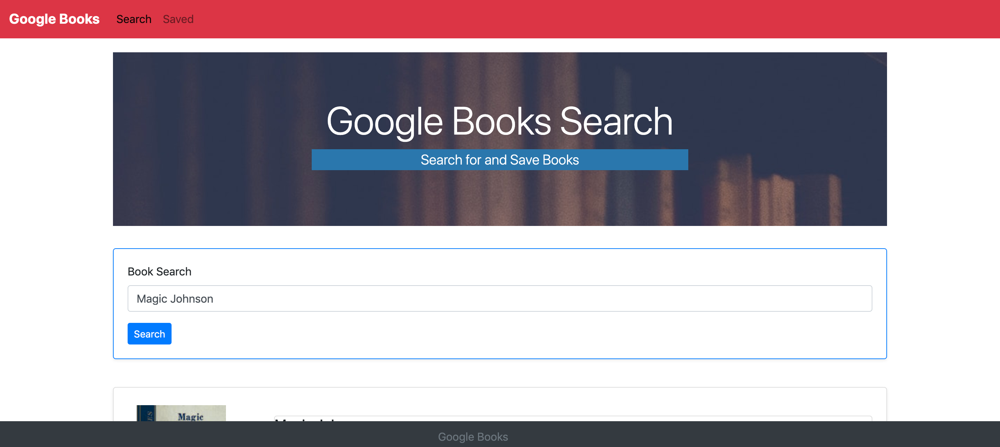

# Google Books Search - MERN Stack

##  

## Purpose

Mongoose, Express, React & Node come together to allow users search and save books from Google Books.

## Deployment

Project was deployed on Heroku and can be tested [here](https://googlebooksearch206.herokuapp.com/).

## Usage

Type in the Title of a Book and search. Click on Save to save the book for later use.

## Technologies and Techniques Used

This project was created using the following:

- Heroku
- MERN Stack (MongoDB Express React Node)
- Axios - Promise based HTTP client for the browser and node.js
- MVC Design Pattern

## Development Notes

This Application runs on a Heroku Server utilizing Node, Express, MongoDB & React.

## Contributing

- Fork it (https://github.com/jobu206/google-book-search/fork)
- Create your feature branch `git checkout -b feature/google-book-search`
- Commit your changes `git commit -am "Add your Message Here"`
- Push to the branch `git push origin feature/google-book-search`
- Create a new Pull Request

## Support

- Open a new issue [here](https://github.com/jobu206/google-book-search/issues/new) for support.

## License

This project is licensed under the MIT License - see the [LICENSE.md](LICENSE.md) file for details.
